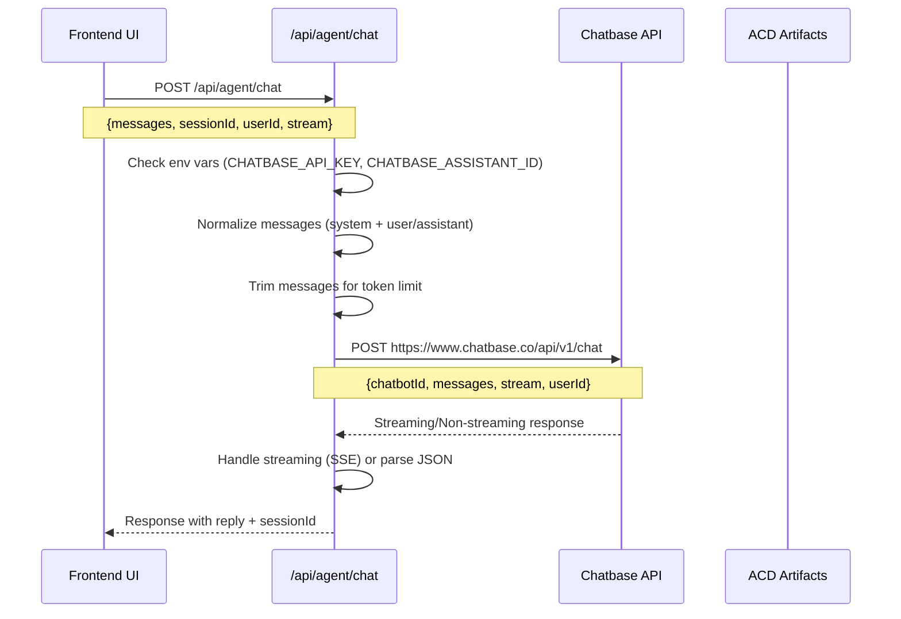

# Chatbase Integration Flow Documentation

## Overview

The ACD agent system uses Chatbase for natural language processing and response generation. This document maps the current integration flow and identifies key components for safe wrapper implementation.

## Current Flow Sequence



## File Paths & Components

### Core Integration Files
- **`ui/cursor-dashboard/app/api/agent/chat/route.ts`** - Main agent endpoint
- **`ui/cursor-dashboard/app/page.tsx`** - Frontend UI integration

### Key Functions & Classes
- `POST()` - Main request handler in route.ts
- `normalizeMessagesForChatbase()` - Message format conversion
- `trimMessagesForTokenLimit()` - Token management
- `handleStreamingResponse()` - SSE stream processing
- `ivHeaders()` - Identity verification headers

## Request/Response Schema

### Request Shape (to Chatbase)
```typescript
{
  chatbotId: string,           // CHATBASE_ASSISTANT_ID
  messages: Array<{
    role: "user" | "assistant",
    content: string
  }>,
  stream?: boolean,
  userId?: string
}
```

### Response Shape (from Chatbase)
```typescript
// Streaming (SSE)
data: {"content": "response_chunk"}

// Non-streaming
{
  text?: string,
  reply?: string,
  message?: string
}
```

## Configuration & Environment

### Required Environment Variables
- `CHATBASE_API_KEY` - API authentication
- `CHATBASE_ASSISTANT_ID` - Bot identifier
- `CHATBASE_SIGNING_SECRET` - User identity verification
- `NEXT_PUBLIC_AGENT_CHAT_ENABLED` - Feature flag
- `NEXT_PUBLIC_AGENT_CHAT_STREAM` - Streaming toggle

### Feature Flags
- `CHATBASE_USE_LEGACY` - Legacy endpoint selection
- `AGENT_PROVIDER` - Provider selection (to be added)

## Error Handling & Fallbacks

### Current Error Mapping
- **401/402/429** → HTTP 502 with `chatbase_${status}` error
- **5xx** → HTTP 502 with upstream details
- **Timeout** → HTTP 502 with timeout error
- **No API Key** → Mock response with `x-agent-mode: mock`

### Mock Response System
- `getMockResponse()` - Fallback when no API key
- Returns templated responses for common queries
- Headers: `x-agent-mode: mock`

## Streaming vs Non-Streaming

### Streaming (SSE)
- Content-Type: `text/event-stream`
- Format: `data: {"content": "chunk"}`
- End signal: `data: [DONE]`
- Handled by `handleStreamingResponse()`

### Non-Streaming
- Content-Type: `application/json`
- Direct JSON response parsing
- Fallback when streaming fails

## Conversation State & Memory

### Session Management
- `sessionId` - User-provided or auto-generated
- Stored in response, not persisted server-side
- Chatbase handles conversation context

### Message Normalization
- System messages prepended to first user message
- Role-based conversion (user/assistant)
- Legacy type support (user/agent/bot)

## ACD Artifacts Integration

### Current State
- **No direct artifact injection** in current implementation
- Artifacts stored in:
  - `artifacts/vmm/seed-{seed}/provenance.json`
  - `cases/atp/artifacts/atp_analysis_results_seed_{seed}.json`
  - `reports/` directory for analysis outputs

### Artifact Access Points
- VMM provenance: `src/acd/vmm/provenance.py`
- Evidence bundles: `src/acd/evidence/bundle.py`
- Analysis results: Various JSON files in artifacts/

## Timeouts & Retries

### Current Implementation
- **No explicit retry logic** implemented
- **No timeout configuration** visible
- Errors passed through directly to UI

### Error Categories
- Environment errors (missing keys)
- API errors (4xx/5xx responses)
- Streaming errors (malformed SSE)
- Parsing errors (invalid JSON)

## Security & Authentication

### Identity Verification
- `ivHeaders()` generates HMAC-SHA256 user hash
- Headers: `X-Chatbase-User-Id`, `X-Chatbase-User-Hash`
- Optional feature (requires `CHATBASE_SIGNING_SECRET`)

### API Key Management
- Bearer token in Authorization header
- Masked in error logs (first 10 chars only)

## Integration Points for Wrapper

### Safe Wrapper Requirements
1. **Preserve existing behavior** - No changes to current flow
2. **Add provider abstraction** - `ChatbaseAdapter` interface
3. **Implement offline fallback** - Mock provider for testing
4. **Maintain error handling** - Same error codes and responses
5. **Support streaming** - Both SSE and non-streaming modes

### Key Integration Points
- Message normalization (preserve system message handling)
- Error response format (maintain existing error codes)
- Streaming response handling (SSE format preservation)
- Session management (sessionId handling)
- Environment variable usage (no changes to existing vars)

## Notes for Implementation

### Non-Invasive Changes Required
- Add `AGENT_PROVIDER` environment variable
- Create adapter interface in `src/agent/providers/`
- Implement offline mock in separate files
- Add fallback logic in existing endpoint
- Preserve all existing error handling and response formats

### Testing Considerations
- Mock responses already exist for no-API-key scenario
- Streaming tests need SSE format validation
- Error handling tests need status code verification
- Session management tests need sessionId persistence


